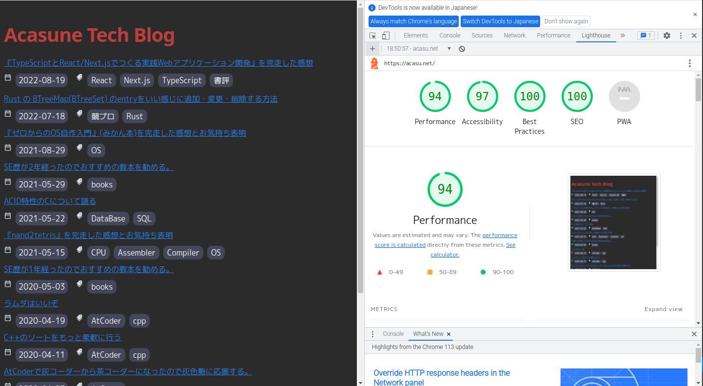

はじめてフロントエンドのフレームワークを触ってから 2 年半くらい経つが、ようやく勘所みたいなものがつかめてきた。

いつもは見様見真似、手習いで作っていたが、
『[TypeScript と React/Next.js でつくる実践 Web アプリケーション開発](https://amzn.to/3c2VCzi)』を経ることで気をつけなければいけない点や要件の実装方針がわかるようになり、また、TypeScript のことが好きになったこともあり、じゃあいままで Gatsby で実装していたものを Nextjs で換装してやろうじゃないかというそういうモチベーションでした。

あと個人的に PC を買い替えたのも区切りの意味で大きかったです。

今回は UI コンポーネントライブラリとして Chakuraui を採用しました。やっぱり Emotion や Tailwindcss などと比べると、カスタマイズが楽でいいなと感じました。バックエンドを主戦場としてやっている僕みたいな人はやっぱり UI コンポーネントライブラリに頼りたいですよね。

一方で Emotion や Tailwindcss を使いこなせる人にも憧れるのでまた小さなプロダクトを作るときは設計もちゃんと考えてやってみようかな。

また、記事の原本に相当する markdown ファイルはどのように html に変換するのかは個人的な興味でしたが、ライブラリのちからを借りつつも自分で実装できてよかったと思います。

最近は「書くこと」を頑張ろうと思っています。僕自身もともと消費型で、大体本読んで自分が満足して終わりだったんですが、同じ業種に一定以上いると、生産の方もするべきではないかという思いに日に日にかられるようになりました。このあたりの心境の変化もいつか書きたいと思います。

僕は（というより多くの人は？）アウトプットをするのが苦手であり、その理由は品質にこだわるあまり、70~80%くらいの完成度のところでさじを投げちゃうからだと考えています。

実はこのブログの換装も 95%くらい半年前くらいに作っていたんだけど、LightHouse のパフォーマンスが 50 切る事象がどうしても直せなかったのをお蔵入りにしていたんですよね。

でもこのまま手元に残しておいて、誰の目にも止まらないのももったいないなと思って一念発起しました。実際触ってみて開発モードでビルドしていることが原因であることがわかり、プロダクションモードでビルドすると無事 92 程度マークすることができました。

実際にリリース後に計った結果。94 まであがった。Nextjs すごい。

閑話休題。そんなわけでまずは雑でもいいからアップしてみるを目標に頑張ろうと思います。
僕がエンジニア歴 1 年めに作ったポートフォリオサイトも結構こだわっていて、思い入れがあるので、カオス極まっている現状をリファクタリングしてあげようと思います。  
[https://acasune-portfolio.com/](https://acasune-portfolio.com/)

あとは最近継続している ScrapeBox のメモも続けていきたいです。  
[https://scrapbox.io/acamemo/](https://scrapbox.io/acamemo/)

とりとめもない感じになりましたがそれでは。
