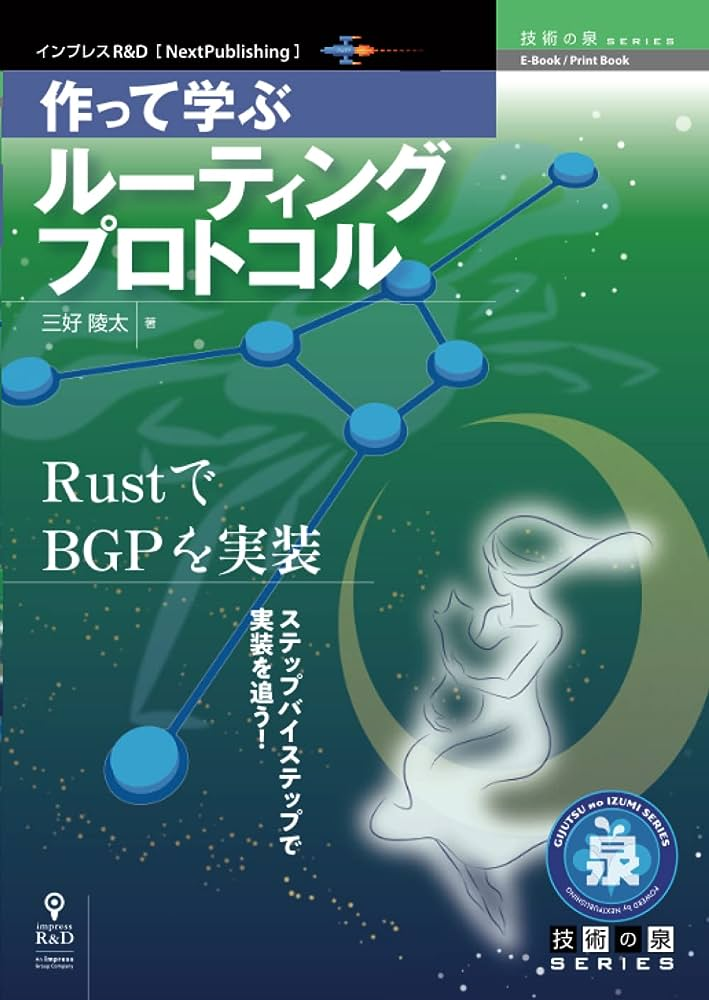

『[作って学ぶルーティングプロトコル　 Rust で BGP を実装](https://amzn.to/3Kj5rr0)』

タイトル通り、Rust で BGP を RFC から実装するというもの。

RFC をもとに何かを実装する経験は今までしたことがなかったので、そのような活動の追体験もできて楽しかったです。

BGP はネットワークの中でもあまり馴染みのあるプロトコルではないし、他のノードに経路情報を交換するという内容からとても複雑な実装になるだろうと思っていたが、いざ実装してみると特につまることなく最後まで完走することができました。
総時間は 3 日まるまるくらいでした。

BGP はイベント駆動のステートマシンとして実装できるそうです。状態の遷移を実装するプログラムは個人的に思想的な美しさを感じて好きですが、今回もそのシンプルさに惹かれました。（当然基本的にステートマシンとして実装するとは複雑さが爆発しがちなのでしっかりした設計をすることが大前提ですが...。）

このようにコンピュータ・サイエンスは「一見複雑で魔法みたいだけど、丁寧に開いてみると単純な仕組みの積み重ねだ」と理解できることが多いですが、BGP もまさにそのような例でした。

また、最近 Rust を書いていなかったので良いリハビリになりました。0 から書くのは大変ですが、すでに用意してあるコードを読む、写経するにはとてもとっつきやすい言語だなと改めて感じました。Docker も同様にリハビリになりました。Dokcer コンテナ間の通信を覗く経験をしたことがなかったのでいい経験になりました。

一方、個人的にはせっかく作ったのでもっと遊んでみたかったです。例えば WireShark を使ってパケットをトレースする話が乗っているんですが、実際に流れる情報の解説があると嬉しかったと思います。

総評としてネットワーク実装の面白さに触れられて満足です。Rust のネットワーク実装といえばこちらの『[Rust で始める TCP 自作入門](https://amzn.to/44LvL58)』で TCP を実装できるそうなので興味を持ちましたが、他にやりたいことが多く、仕事に直結しない点で優先度はやや低めです。

## リンク

- 著者様の公開リポジトリ：[https://github.com/Miyoshi-Ryota/mrbgpdv2/tree/main](https://github.com/Miyoshi-Ryota/mrbgpdv2/tree/main)
- 私の実装：[https://github.com/Acasune/mrbgpdv2-study](https://github.com/Acasune/mrbgpdv2-study)
